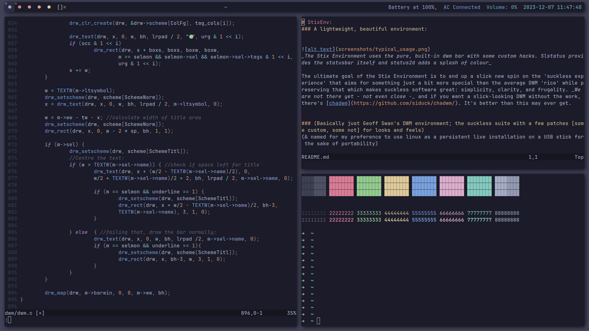
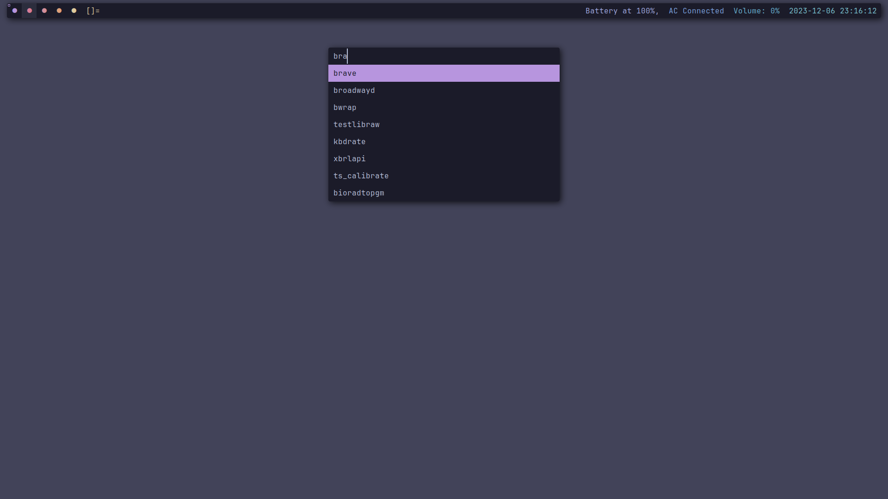

# StixEnv: 
### A lightweight, beautiful environment:

 
_The Stix Environment uses the pure, built-in dwm bar with some custom hacks. Slstatus provides the statusbar itself and status2d adds a splash of colour_

The ultimate goal of the Stix Environment is to end up a slick new spin on the 'suckless experience' that aims for something just a bit more special than the average DWM 'rice' while preserving that which makes suckless software great: simplicity, clarity, and frugality. _We are not there yet - not even close -_ and if you want a slick-looking DWM without the work, there's [chadwm](https://github.com/siduck/chadwm/). It's better than this may ever get.

### (Basically just Geoff Swan's DWM environment; the suckless suite with a few patches [some custom, some not] for looks and feels)
(& named for my preference to use linux as a persistent live installation on a USB stick for the sake of portability)

__This is very, *very* much a work in progress: use for reference, don't run in production just yet; right now the codebase is dirty and full of stupid little idiosyncrasies and poor naming conventions that only I can interpret.__

 
_The Stix Environment features a fairly typical (albiet patched and customised) build of dmenu, and makes extensive use of dmenu to provide option menus and text prompts to control power, brightness, volume, and more"_

__StixEnv :: Colours__

The Stix Environment uses the Catppuccin colourscheme: soft and easy on the eyes, and featuring vast support for just about every application that people in our sphere use, it should be exceptionally easy to theme one's entire workflow to match Stix for a particularly cohesive experience

__StixEnv :: ST__

I debated including ST's source because it's hardly StixEnv::ST at all: it's one pre-made patch (anysize, so that ST fills the space it's given) applied to Suckless' *Simple Terminal* and a very minor alteration to the `config.h` colours provided by Catppuccin themselves. I included it anyway, since it's part of the environment, and as time goes on I will further differentiate it from stock ST.

__StixEnv :: DWM__

The Stix Environment uses DWM for the window manager, with a few alterations:

    * The 'dot tag' tag / 'workspace' indicators are a custom addition found around line 850 in the souce code; they can be substituted for any character and soon users will have the ability to specify the character in `config.h`
    * Tag indicators are now coloured with colours specified in config.h - this is a potential source of an out-of-range range as the code doesn't actually check to see if enough colours have been specified. This will change.
    * Window titles and status bars display across all monitors; the window title is centred, and its colour can be specified in `config.h`
    * Patches `vanitygaps` and `barpadding` space everything out a little, with the help of a couple of custom padding options exclusive to this build
    * The `status2d` patch allows for (relatively) user-friendly colouring of both foreground and background in the status text
    * I expect StixEnv::DWM to become the focal point for this environment, at least until I expand into other areas and build this out into a more complete DE with fully-custom tools: as a result, the custom DWM build will see lots of work!

__StixEnv :: dmenu__

The Stix Environment relies heavily on dmenu, and dmenu will only become more intertwined with the environment; so far, it's responsible for a couple of proof-of-concept system-control dialogues (power menu, backlight control, and volume control), and as time goes on it will become increasingly responsible for allowing the user to fine-tune StixEnv on-the-fly. These dialogues are defined and launched primarily from shell scripts written for the FISH shell and found in the scripts directory. These are bound to key-commands in dmenu which expect to see them in `/usr/share/scripts`. This is not ideal, and won't be standard practice in StixEnv for long

StixEnv::dmenu is a fairly standard build of dmenu; `center` confines the dmenu to a region in the centre of the screeen (a custom option in `config.h` allows the user to specify y-position to control the precise vertical position of dialogues), while `fuzzymatch` implements fuzzyfinding for option menus

- MORE TO COME (BOTH DOCS AND ACTUAL CODE) VERY SOON -

I DON'T UNDERSTAND LICENSING: The MIT/X Consortium License (under which Suckless software is licensed) permits sublicensing, and since MIT/X is a subset of GPL (as I understand it; I'm a child and not a lawyer), I did consider sublicensing under GPL because I like it but MIT is really straightforward and I really do not want to wander into actual legal territory regardless of how permissive and libre the metaphorical hornet's nest I'm poking may be. Everything here is under MIT/X Consortium.
